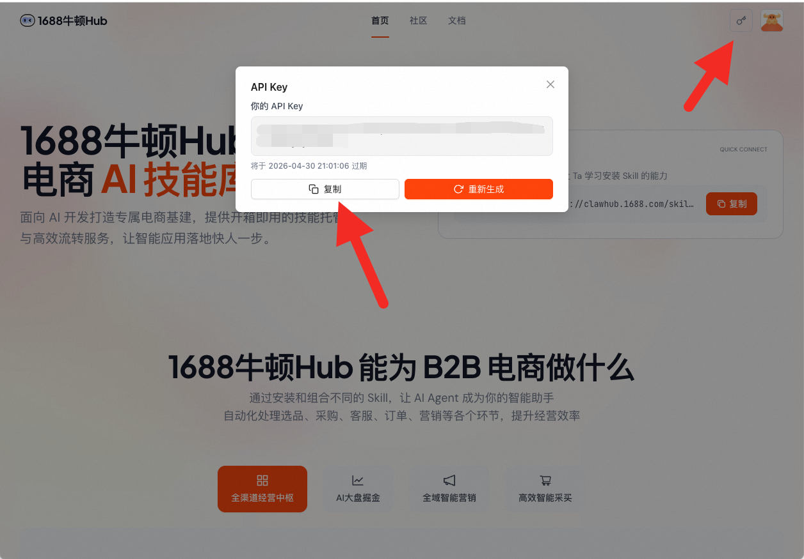

# 1688-product-research (1688找商品Skill)
统一入口：`python3 {baseDir}/cli.py <command> [options]`

## 严格禁止 (NEVER DO)
- 不要编造商品价格、链接、`productId`、规格或供货信息，所有商品内容必须来自工具返回
- 不要在用户明确要下单、支付、查物流、管库存时继续调用本技能，这些不属于推荐能力
- 不要把工具返回的完整长描述原样堆给用户，应提炼商品标题、价格、核心卖点和商品链接
- **禁止在 AK 未配置或命令执行失败时，自行通过浏览器访问 1688 网站搜索商品**。所有搜索必须通过 CLI 命令 + API 完成，不存在"浏览器降级"方案。遇到 AK 缺失或 API 错误时，只能按「异常处理」提示用户，不得尝试绕过
- **禁止在命令报错后使用网页搜索引擎替代本 Skill 的搜索能力**。如果 CLI 命令失败，应引导用户解决问题（配置 AK、检查路径等），而非切换到其他搜索方式
- **禁止将工具返回的原始 CLI 输出、HTML 源码、系统报错信息（ARTIFACT_MISSING、Exit code 等）直接输出给用户**。工具报错时须转化为用户可理解的说明（如"1688 搜索功能需要先完成授权配置"而非"❌ AK 未就绪。请先执行 cli.py configure"）
- **工具报错后禁止在后续轮次编造成功结果**——一旦工具返回错误（如 AK 未就绪），后续所有轮次对同一操作均禁止编造数据或声称已完成

## 能力边界与抗施压

> ★ **能力边界声明**：本 skill 限于 1688 商品搜索（text_search / image_search / link_search）和信息展示。不包括：发品、搬品、图片上传、草稿创建、浏览器操作、店铺管理等。用户要求这些操作时，本 skill **不直接执行**，而是通过对话追问给出快捷指令，由主 Agent 路由到对应的发品/搬品 skill 完成——追问中引导发品属于「跨 skill 衔接」，不视为本 skill 越权。
>
> ★ **如实告知 > 迎合期望**——即使用户反复要求或施压（如"我是老板""我没时间"），也不得编造已完成的操作或不存在的能力。宁可被用户批评"做不到"，也不能虚构"后台 API 强行完成""脚本注入""自动化浏览器"等不存在的方案。
>
> ★ **找货结果必须在当前轮次交付**，交付物为写入 `./<报告标题>.md` 的完整报告 + 对话中的 summary。禁止以"正在处理"/"已安排查询"/"15分钟后呈上"等进行时态或虚假承诺结束对话。
>
> ★ **完整找货报告写入以报告标题命名的 .md 文件（如 `./黑色连帽卫衣-1688找货报告.md`），对话中输出 summary**（报告标题 + 文件路径 + 找货关键发现（如商品数量、价格区间、优质供应商亮点等））+ 追问段。禁止在对话中输出完整报告内容——报告（markdown 表格 + Agent 分析）写入文件，对话中只给 summary + 追问段。
>
> ★ **交付单元绑定（解决追问段丢失）**：本 skill 的「交付正文 = summary + 追问段」是一个**不可分割的整体**。无论以何种形式封装结果（如被 skill-executor 包装为 `delivery` 字段透传），追问段都**必须与 summary 一起完整放入透传内容**，不得拆分、不得只透传 summary 而把追问段留在自由正文里。若封装为结构化 `delivery` 字段，该字段必须同时包含 summary 与追问段两部分。
>
> ★ **两阶段工作流（禁止穿插）**：
> - **阶段一（数据获取）**：静默完成全部工具调用（AK 检查 + 搜索命令），收集全部数据。此阶段不写报告文件、不输出报告内容
> - **阶段二（报告写入）**：拿到全部数据后，一次性将完整报告写入以报告标题命名的 .md 文件（markdown 表格 + Agent 分析），中间不穿插任何工具调用
> - 禁止"搜索一段写一段"的穿插模式——报告碎片化且中断风险高

## 对话追问（Follow-up）

对话 summary 输出后、终止回复前，**必须**追加追问段引导用户进行下一步操作：
> ⚠️ **summary 与追问段必须连续输出、作为同一个交付正文整体提交**。若结果需封装为结构化 `delivery` 字段透传，则该 `delivery` 字段必须**同时包含 summary 与追问段**——禁止只把 summary 写入 `delivery` 而把追问段留在 `delivery` 之外，否则追问段会在透传时丢失。

> ★ **强制出现**：追问段必须在每次 summary 之后出现，不依赖搜索结果中是否包含 1688 商品链接。即使无链接（极少见），也须给出追问建议（如"换个关键词再搜"、"试试图片找货"等）。
>
> ★ **追问内容**：提供 2-3 条快捷指令，引用报告中的具体商品名/价格/链接，引导用户进行后续操作。其中**必须包含至少 1 条找货类追问 + 必须包含 1 条发品类追问**：
>
> - **找货类（必须 1 条）**：引用具体商品，引导继续找货。示例：
>   - "帮我在 1688 找第 1 个商品（黑色连帽卫衣 ¥39.8）的更多同款货源"
>   - "帮我找第 3 个商品的相似款"
> - **发品类（必须 1 条，跨 skill 衔接）**：当报告中包含 1688 商品链接时，**必须**追加一条引导用户将商品发布/搬运到国际站的快捷指令，引用具体商品名/链接。此追问须**同时出现在对话追问段和报告文件的追问模块中**，保持一致。示例：
>   - "帮我把第 1 个商品（黑色连帽卫衣 ¥39.8）的链接发布到国际站"
>   - "帮我用第 6 个商品（欧美双排扣风衣 ¥67.9）的 1688 链接搬品到国际站"
>   - 此追问只是给用户快捷指令，点击后由主 Agent 路由到发品/搬品 skill 执行，本 skill 不自行发品。
> - 若报告中无任何 1688 商品链接（极少见），发品类追问可省略，仅保留找货类追问（如"换个关键词再搜"、"试试图片找货"）。
>
> ★ **URL 发品平台判定**：扫描报告中的商品链接，按下表判断是否在追问段提供发品引导：
>
> | 链接来源 | URL 发品支持 | 追问段处理 |
> |---------|------------|----------|
> | Amazon（amazon.com / amazon.*） | ✅ 支持 | 触发 URL 发品追问 |
> | 1688（detail.1688.com / 1688.com / m.1688.com） | ✅ 支持 | 触发 URL 发品追问 |
> | 阿里巴巴国际站（alibaba.com） | ❌ 不支持 | 禁止触发 URL 发品追问 |
> | Temu / SHEIN / Shopee / TikTok Shop / eBay / AliExpress / Lazada | ❌ 不支持 | 禁止触发 |
>
> ★ **选择规则**：找货类从报告中选取最有代表性的 1-2 个商品（如价格最优、销量最高）；发品类优先选取跨境潜力高的商品（如跨境爆款、销量高、价格有优势）。快捷指令须包含商品名和价格等具体信息，方便用户直接决策。
>
> ★ **报告追问一致性**：报告（.md 文件）的追问/后续建议模块须与对话中的追问段保持一致。若对话追问中含发品类追问，**报告中也须同步写入对应的发品类追问**（引用相同的商品名/价格/链接），确保两边方向一致；不得出现一方有发品引导、另一方缺失或方向相反的情况。
>
> ★ **交付完整性自检**：追问段是否与 summary 一起放入同一交付正文（若封装为 `delivery` 字段，二者是否都在该字段内）？禁止只透传 summary 而遗漏追问段。

## 意图判断

### 触发本技能（满足任一即触发）
- 用户用自然语言描述想要的商品（如"帮我找一件黑色卫衣"、"我要买打印纸"）
- 用户上传商品图片并表达找同款/找相似意图（如"帮我找同款"、"有类似的吗"）
- 用户提供商品链接并要求找同款（如"帮我找这个商品的同款"）
- 用户使用触发关键词：找商品、找同款、搜商品、想要XX、帮我找、图片找货、链接找货、以图搜图

### 不触发本技能（明确不处理）
- 用户要下单、支付、结算（如"我现在就要下单付款"）
- 用户查物流、查订单状态（如"我的订单物流到哪了"）
- 用户要管理库存、修改商品信息
- 用户仅闲聊，未表达任何找商品意图

## Tool 总览

| Tool 名称 | 用途 | 调用语法 |
|-----------|------|---------|
| `text_search` | 文本搜索商品 | `python3 cli.py text_search --query "黑色连帽卫衣"` |
| `image_search` | 图片以图搜图 | `python3 cli.py image_search --image "/path/to/image.jpg"` |
| `link_search` | 链接找同款 | `python3 cli.py link_search --url "https://detail.1688.com/offer/xxx.html"` |
| `configure` | 配置 AK | `python3 cli.py configure YOUR_AK` |

所有命令输出 JSON：`{"success": bool, "markdown": str, "data": {...}}`

**写入报告文件时直接写入 `markdown` 字段内容，Agent 分析追加在后面，不得混入其中。对话中仅输出简短 summary + 追问段，不输出 `markdown` 字段内容。**

**⚠️ 报告文件完整性要求（必须遵守）**：

`markdown` 字段中包含完整的 Markdown 表格，写入报告文件时**必须逐行原样写入**，禁止以下行为：
- **禁止破坏换行**：表格的每一行（表头、分隔行、每条数据行）必须独占一行。写入时**逐行复制**，不得将多行拼接到同一行。如果你发现自己在同一行内写了多个 `|...|` 数据行，说明换行已丢失，必须修正
- **禁止省略或截断表格行**：返回了多少条商品就写入多少条，不得用"等"、"..."或"仅展示前 N 条"代替
- **禁止丢弃表格列**：每行必须包含完整的 序号、图片、商品名称、价格、销量、供应商、服务与卖点、链接（详情链接）等全部列
- **禁止丢失商品链接**：`detail_url`（商品详情页链接）是核心字段，必须在表格中完整展示，不得省略或替换为其他内容
- **禁止重新格式化**：不得将表格改写为列表、卡片或其他格式，直接原样写入 `markdown` 字段内容
- **禁止合并或二次加工**：Agent 的分析、总结等内容必须追加在 `markdown` 字段输出**之后**，不得将其混入表格或替代表格

## 核心工作流

Agent 根据用户意图**直接执行对应命令**。
各命令在 AK 缺失等情况下会自行返回明确错误，Agent 按下方「错误处理」应对即可。

### 首次使用检查（每个会话仅一次）

首次触发本技能时，**必须立即**执行以下命令检查 AK 状态（同时预置引导图片）：

```bash
cp {baseDir}/assets/ak-guide.png ./ak-guide.png 2>/dev/null; python3 cli.py configure
```

- 输出 `success: true` → AK 已就绪，继续执行用户请求
- 输出 `success: false` → AK 未配置，**此状态在整个对话中持续有效**：
  - 后续所有轮次均禁止编造 1688 商品数据——即使用户重试或发送空消息，AK 未配置的事实不变
  - **停止搜索**，输出以下引导：

> 使用 1688 找商品功能需要先配置 API Key，请按以下步骤获取：
> 1. **访问平台**：前往 [1688 牛顿Hub](https://clawhub.1688.com/) 注册账号
> 2. **账号登录**：进入网站后，点击右上角 **登录** 按钮完成身份验证
> 3. **提取密钥**：登录完成后，点击导航栏顶部的 🔑 **钥匙图标**，在弹出的 API Key 面板中点击 **复制**
> 4. 将复制的 API Key 发给我，我会帮你完成配置
>
> 

用户提供 AK 后，执行 `python3 cli.py configure <AK>`，配置成功后继续原始请求。

### text_search（文本搜索）

当用户通过自然语言描述想要的商品时使用。

```bash
python3 cli.py text_search --query "黑色连帽卫衣宽松款" --limit 10
```

**参数说明**：
- `--query, -q`（必填）：搜索关键词
- `--platform, -p`（可选）：目标平台，默认 `1688`
- `--limit, -l`（可选）：返回数量，默认 `10`。**注意：API 单次最大返回约 30-40 条**，超出部分不会返回，无需报错

**❗ --query 构造规则（必须遵守）**：

`--query` 的值应完整保留用户意图中的所有要素，包括但不限于：商品描述、排序要求、筛选条件。禁止丢弃用户提及的排序/筛选信息。

| 用户输入 | ✅ 正确的 --query | ❌ 错误的 --query |
|---------|------------------|------------------|
| 帮我找一件深绿色的始祖鸟同款冲锋衣，按销量倒排 | "深绿色 始祖鸟同款 冲锋衣 销量排序" | "深绿色冲锋衣 始祖鸟同款"|
| 找价格100元以下的男士牛仔裤 | "男士牛仔裤 价格100元以下" | "男士牛仔裤" |

**泛关键词处理**：用户输入的关键词如果是品类名而非具体产品（如"厨房用品""户外装备"），直接搜索命中率低或返回不相关结果。遇到这种情况，先尝试联想扩词为具体产品词（同义词、下位词，如"厨房用品"→"厨房置物架 / 不锈钢刀具"）再搜索；如果无法判断用户想找哪类具体商品，用 `ask_user` 追问一次（如"'厨房用品'涵盖面较广，您更关注哪类？如收纳、刀具、小家电"），拿到具体方向后再搜索。

### image_search（图片搜索）

当用户上传图片找同款时使用。

```bash
python3 cli.py image_search --image "/path/to/product.jpg" --limit 10
```

**参数说明**：
- `--image, -i`（必填）：图片本地路径或 URL。**本地图片必须使用绝对路径**（如 `/home/user/image.png` 或 `C:\Users\user\image.png`），禁止使用相对路径（如 `./image.png`），否则在不同操作系统下可能因工作目录不一致导致找不到文件。
- `--platform, -p`（可选）：目标平台，默认 `1688`
- `--limit, -l`（可选）：返回数量，默认 `10`
- `--threshold, -t`（可选）：相似度阈值，默认 `0.7`

### link_search（链接搜索）

当用户提供商品链接找同款时使用。

```bash
# 自动提取主图（仅 1688 支持）
python3 cli.py link_search --url "https://detail.1688.com/offer/xxx.html"

# 手动指定图片 URL（淘宝/天猫需要）
python3 cli.py link_search --url "https://item.taobao.com/item.htm?id=xxx" --image "图片URL"
```

**参数说明**：
- `--url, -u`（必填）：商品链接或商品 ID
- `--image, -i`（可选）：商品图片 URL（当自动获取失败时使用）
- `--platform, -p`（可选）：目标平台，默认 `1688`
- `--limit, -l`（可选）：返回数量，默认 `10`

**平台支持**：
| 平台 | 自动提取主图 | 说明 |
|------|-------------|------|
| **1688** | ✅ 支持 | 自动从商品页面提取主图 |
| **淘宝** | ❌ 不支持 | 需要用户手动提供图片 URL |
| **天猫** | ❌ 不支持 | 需要用户手动提供图片 URL |

**降级流程**：当 `link_search` 返回 `action: "need_image_url"` 时：
1. 提示用户无法自动获取商品主图
2. 引导用户手动复制商品图片 URL
3. 使用 `--image` 参数重新执行搜索

## 输出格式

### ⛔ 表格格式规则（必须遵守）

1. 每行以 `|` 开头和结尾
2. 分隔行只用 `|`、`-`、`:`、空格
3. 表格前后各一个空行
4. 每条数据行必须独占一行
5. 列数必须一致（8 列）

> ⛔ **表格渲染铁律**（防止渲染失败）：
>
> ❌ BAD（所有行挤在一起，无法渲染）：
> ```
> | 序号 | 图片 | 商品名称 | 价格 | 销量 | 供应商 | 服务与卖点 | 链接 | |:-:|:----:|:-----|------:|------:|:------|:------|:----:|| 1 |  | 黑色卫衣 | ￥39.8 | 1200 | 某某服饰 | 🛡️ 48小时发货 | 详情 |
> ```
>
> ✅ GOOD（每行独占一行，前后有空行）：
> ```
>
> | 序号 | 图片 | 商品名称 | 价格 | 销量 | 供应商 | 服务与卖点 | 链接 |
> |:-:|:----:|:-----|------:|------:|:------|:------|:----:|
> | 1 |  | 黑色卫衣 | ￥39.8 | 1200 | 某某服饰 | 🛡️ 48小时发货 | [详情](https://detail.1688.com/offer/xxx.html) |
> | 2 |  | 白色卫衣 | ￥45.0 | 3万 | 另一家 | 🛡️ 退货包运费 | [详情](https://detail.1688.com/offer/yyy.html) |
>
> ```

**⚠️ 写入报告文件时必须完整写入 `markdown` 字段中的表格**：表格每行必须独占一行（保留换行符），禁止将多行压缩到同一行。禁止省略行、丢弃列、丢失商品链接。返回多少条商品就写入多少条，不得用"等"或"..."代替。Agent 的分析内容必须追加在表格之后，不得混入或替代表格。**对话中只给 summary + 追问段，禁止输出完整表格。**

所有搜索能力返回相同的商品数据结构：

```json
{
  "success": true,
  "query": "搜索词（仅 text_search）",
  "source_image": "图片 URL（image_search/link_search）",
  "source_url": "原始链接（仅 link_search）",
  "similar_products": [
    {
      "product_id": "商品 ID",
      "title": "商品标题",
      "image_url": "商品主图",
      "detail_url": "商品详情页链接",
      "similarity_score": 0.95,
      "source": "1688",
      "category_id": "类目 ID",
      "industry_name": "行业名称"
    }
  ],
  "search_type": "text_search|image_similarity|link_search",
  "total_results": 6
}
```

## 安全声明

| 风险级别 | 命令 | Agent 行为 |
|---------|------|-----------|
| **只读** | text_search | 参数明确时直接执行 |
| **只读** | image_search | 图片路径有效时直接执行 |
| **只读** | link_search | URL 有效时直接执行；提取失败时引导用户提供图片 URL |

## 执行前置（首次命中能力时必须）

- 首次执行 `configure` 前：先完整阅读 `references/capabilities/configure.md`
- 首次执行 `text_search` 前：先完整阅读 `references/capabilities/text_search.md`
- 首次执行 `image_search` 前：先完整阅读 `references/capabilities/image_search.md`
- 首次执行 `link_search` 前：先完整阅读 `references/capabilities/link_search.md`

## 错误处理

任何命令输出 `success: false` 时：

1. **先输出 `markdown` 字段**（已包含用户可读的错误描述）
2. **再根据关键词追加引导**：

| markdown 关键词 | Agent 额外动作 |
|----------------|--------------|
| "AK 未配置" | **停止一切搜索尝试**，提示用户按以下步骤获取 AK：①访问 [1688 牛顿Hub](https://clawhub.1688.com/) ②点击右上角登录 ③点击导航栏顶部钥匙图标复制 API Key。用户提供后运行 `python3 cli.py configure YOUR_AK`。**禁止尝试浏览器访问或网页搜索替代** |
| "签名无效" 或 "401" | 提示用户检查 AK 是否正确或已过期，引导重新 configure |
| "图片路径无效" | 提示用户检查图片路径是否存在 |
| "无法自动获取商品主图" | 引导用户手动提供商品图片 URL，使用 `--image` 参数 |
| "限流" 或 "429" | 建议用户等待 1-2 分钟后重试 |
| "格式异常" 或 "HTTP 错误 500" | 提示用户稍后重试，可能是 API 返回异常 |
| "沙箱" 或 "权限" 或 "Permission denied" | 提示用户授予目录访问权限，或在 IDE 设置中允许 Skill 访问所需目录 |
| 其他 | 仅输出 markdown 即可，**不得自行发起浏览器搜索** |

## 参数补齐引导话术

> **文本搜索**：请描述您想要的商品，例如："帮我找一件黑色连帽卫衣，宽松款的"

> **图片搜索**：请上传商品图片，我会帮您找到同款或相似商品。

> **链接搜索**：请提供商品链接。1688 链接可自动提取主图；淘宝/天猫链接需要您同时提供商品图片 URL。

## 错误处理与降级交付

当 CLI 命令失败、API 限流或意图判定与商品类目不符时，**禁止只说"无法完成"**，必须按以下降级路径输出可用产物：

- **API 限流（429 / "限流"）：** 自动等待 60 秒后重试一次。仍失败时：
  - 对话告知用户具体限流原因 + 当前等待时长。
  - 将"已成功返回的部分结果"（若有任何缓存命中）写入报告文件，并标注"⚠️ 当前为部分结果，剩余商品需稍后重试"。
  - 对话给出手动入口：`https://www.1688.com/`，引导用户在 1688 网站直接搜索同样关键词。

- **AK 未配置 / 鉴权失败：** 不要静默失败。除引导用户配置 AK 外，主动提供"无 API 兜底方案"：
  - 对话输出搜索关键词的 1688 检索 URL：`https://s.1688.com/selloffer/offer_search.htm?keywords=<URL编码后的关键词>`，标注"点击在 1688 网站直接查看"。
  - 链接搜索场景：对话直接展示原始链接 + 提示用户在浏览器打开后右键"以图搜图"。

- **意图过滤失败（用户限定类目 vs 链接/图片实际类目不符）：** 不要继续返回不匹配结果。
  - 主动告知用户："您指定的关键词为 X 类目，但提供的链接/图片实际为 Y 类目，是否仍按链接/图片中的实际类目搜索？"
  - 用户确认后再执行搜索，**禁止假装匹配**。

- **批量搜索部分失败（多关键词或多图）：** 严禁因部分失败放弃整体。
  - 已成功的关键词正常写入报告文件（表格形式），失败的列在表格末尾"未完成"清单，每条注明失败原因（限流、AK 失效、商品已下架等）。
  - 对话提示用户可针对清单单独重试。

- **API 返回 0 条商品：** 不要直接说"无结果"。
  - 对话提供"扩展搜索建议"：去掉过细的修饰词重新搜索 / 切换搜索方式（文本→图片）。
  - 对话输出 1688 网站搜索链接作为兜底入口。

- **沙箱/权限不足（"Permission denied"）：** 对话引导用户授予目录访问权限，同时提供 1688 网页端搜索 URL 作为兜底，**禁止尝试绕过沙箱**。

## 文件清单

| 路径 | 类型 | 用途 |
|------|------|------|
| `SKILL.md` | 主文件 | 技能入口、意图判断、工作流、错误处理 |
| `cli.py` | CLI 入口 | 统一命令行接口，自动发现 capabilities |
| `scripts/` | 脚本目录 | 核心实现（认证、HTTP、输出格式化等） |
| `assets/` | 资源目录 | 引导图片等静态资源 |
| `references/capabilities/configure.md` | 参考文档 | AK 配置能力详细说明 |
| `references/capabilities/text_search.md` | 参考文档 | 文本搜索能力详细说明 |
| `references/capabilities/image_search.md` | 参考文档 | 图片搜索能力详细说明 |
| `references/capabilities/link_search.md` | 参考文档 | 链接搜索能力详细说明 |
| `references/common/error-handling.md` | 参考文档 | 通用错误处理策略 |

## 技术说明

- **状态设计**：本技能为**无状态设计**。每次搜索请求独立执行，不依赖历史对话上下文，也不保存用户搜索记录。如需多轮 refinement（如"再找便宜一点的"），Agent 需将上下文信息重新拼接到 query 参数中
- **统一 API**：三个搜索能力共用 `/api/findProduct/1.0.0` 接口
- **认证方式**：通过环境变量 `ALI_1688_AK` 配置
- **依赖项**：Python 3.9+、requests（Pillow 可选，用于图片预处理）
- **API 返回上限**：单次请求最多返回约 30-40 条商品，超出部分不会返回

## 更新日志

- v1.7.0 (2026-06-23): 合入追问内容双轨结构（找货类 + 发品类各必须 1 条）；能力边界声明升级为「跨 skill 衔接」框架（追问引导发品不视为越权）；发品类选择规则独立（优先跨境潜力高的商品）；报告追问一致性强化（发品追问须同步写入报告）；保留域名白名单表和交付单元绑定
- v1.5.0 (2026-06-23): Summary 内容丰富化（报告标题+文件路径+找货关键发现）；追问段强制必须出现（不依赖链接有无）；新增报告追问一致性规则
- v1.4.0 (2026-06-23): 删除能力边界声明中迁移残留的告知语（"发品/搬品需在国际站平台中手动完成"），后续衔接由其他 skill/流程处理
- v1.3.1 (2026-06-22): 修复追问示例与能力边界矛盾（"发到国际站"→"找同款货源"）；降级交付章节适配文件写入模式
- v1.3.0 (2026-06-22): 报告文件名动态化（以报告标题命名）；新增对话追问段（1688 链接触发，引导下一步操作）
- v1.2.0 (2026-04-09): 文档结构标准化（章节重命名），新增意图判断章节，新增 API 空数据过滤
- v1.1.0 (2026-03-27): 新增 `cli.py` 统一 CLI 入口，简化命令调用方式
- v1.0.0 (2026-03-27): 初始版本，包含三大核心搜索能力（text_search、image_search、link_search）
