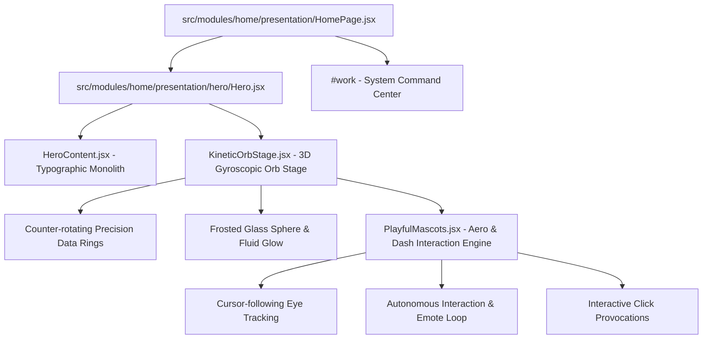

# Page 1 Entry Experience — Sophisticated Kinetic Orb & Playful Mascots Design Spec

**Date:** 2026-08-27  
**Status:** Approved for Implementation  
**Scope:** Re-architecting Page 1 (Hero Viewport) into a clean, high-conviction entry portal with a sophisticated kinetic glass orb and playful interactive brand mascots (Aero & Dash).

---

## 1. Executive Summary & Intent

The portfolio's home screen is split into two distinct architectural stages:
1. **Stage 1 (Page 1 Entry Portal - 100vh):** Editorial typography, clear product engineer positioning, and an interactive visual centerpiece (Sophisticated Kinetic Orb with playful Aero & Dash mascots) that delivers immediate brand memorability and personality.
2. **Stage 2 (The Command Center & System Proof):** The full-depth WOS restaurant ecosystem, interactive product constellation, and shipped app telemetry reached via smooth scroll or clicking `[ Explore work ↗ ]`.

```
┌─────────────────────────────────────────────────────────────────────────┐
│  STAGE 1 : THE ENTRY PORTAL (100vh Hero)                                │
│                                                                         │
│  Hx313                                      [Let's talk ↗] [Theme]      │
│                                                                         │
│  PRODUCT ENGINEER · MOBILE & SAAS                                       │
│  A mindset Beyond ordinary.                 ┌─────────────────────────┐ │
│  I turn ambitious ideas into                │  KINETIC GLASS ORB      │ │
│  production-ready software, apps, and       │  • Gyroscopic Rings     │ │
│  SaaS platforms that move businesses.       │  • Aero 🤖 & Dash 🐦    │ │
│                                             │    (Playful Mischief)   │ │
│  [ Explore work ↗ ]  [ Start conversation ] │  • Mouse-reactive 3D    │ │
│                                             └─────────────────────────┘ │
│  ↓ Scroll to inspect system architecture                                │
└─────────────────────────────────────────────────────────────────────────┘
                                   │
                    [ Fluid Scroll / CTA Glide ]
                                   ↓
┌─────────────────────────────────────────────────────────────────────────┐
│  STAGE 2 : THE COMMAND CENTER (WOS Core + Full Constellation Below)     │
└─────────────────────────────────────────────────────────────────────────┘
```

---

## 2. Component Architecture & Responsibilities



### Component Details

1. **`HeroContent.jsx` (Left Column Monolith):**
   * Brand mark `Hx313` with monochrome confidence and teal dot accent.
   * Role kicker: `PRODUCT ENGINEER · MOBILE & SAAS`.
   * High-contrast headline: `A mindset Beyond ordinary.` (with italic serif accent).
   * Focused value proposition line.
   * Primary CTA `[ Explore work ↗ ]` (smooth scrolls to `#work`) and secondary CTA `[ Start a conversation ]` (triggers contact link).

2. **`KineticOrbStage.jsx` (Right Column Centerpiece):**
   * **Outer Gyroscopic Rings:** Thin SVG rings with subtle micro-coordinate ticks (`313.4° / 88.2Hz`), rotating on dual axes in opposite directions with smooth CSS keyframes.
   * **Optical Glass Sphere:** Multi-layered radial gradient with chromatic edge glow (`#14b8a6` teal and `#38bdf8` electric blue), subtle frosted backdrop blur, and a specular light flare that subtly shifts based on mouse coordinates.
   * **3D Perspective Tilt:** Smooth spring-interpolated tilt following desktop cursor motion ($\pm 10^\circ$).

3. **`PlayfulMascots.jsx` (Character Interaction Engine):**
   * **Vector Mascot Assets:** Refined SVG models of **Aero** (dark metallic robot with teal visor and thruster) and **Dash** (vibrant blue Flutter hummingbird).
   * **Cursor Eye-Tracking:** Both Aero's and Dash's pupils calculate vector angles to the mouse position in real-time.
   * **Autonomous Mischief Loop (Every 6–8s):**
     1. *Phase 1:* Dash leans over and pecks Aero's visor $\rightarrow$ a `*peck!*` emote pops up.
     2. *Phase 2:* Aero gets startled, his eyes glitch to `(>_<)` / `(o_O)`, and his thruster sputters with a wobble.
     3. *Phase 3:* Aero recovers, gives Dash a friendly poke back $\rightarrow$ `*boop!*` emote.
     4. *Phase 4:* Dash giggles, does a quick 360° flutter spin, and perches back down.
   * **User Click Provocations:**
     * Clicking Aero triggers an immediate spin move and playful dialog soundless bubble.
     * Clicking Dash triggers a flutter-hop and chirp animation.

---

## 3. Interaction & Motion Rules

* **Performance Budget:** Zero heavy 3D canvas libraries (Three.js / WebGL) required for Page 1; built purely with hardware-accelerated CSS 3D transforms (`transform: translate3d / rotate3d`, `opacity`, and SVG filters), guaranteeing 60fps and zero battery drain.
* **Timing & Easing:**
  * Micro-interactions: `150ms – 250ms` using `cubic-bezier(0.16, 1, 0.3, 1)`.
  * Orb rotation: Calm, continuous ambient loops (`18s` and `24s` durations).
  * Mischief skits: `1.2s` total sequence duration with generous `6s` quiet pauses in between.
* **Reduced Motion:** When `prefers-reduced-motion: reduce` is active:
  * Continuous ring rotations and mascot auto-looping are disabled.
  * Mascots rest in a cute, static paired pose with instant eye updates.

---

## 4. Verification & Testing Strategy

1. **Visual Fidelity & Interaction:**
   * Test mouse-tracking smoothness and click responsiveness on desktop.
   * Verify mobile reflow: on screens $< 900\text{px}$, the orb scales gracefully below the hero copy without horizontal overflow.
2. **Accessibility & Contrast:**
   * Text contrast $\ge 4.5:1$ across all heading and body copy.
   * Keyboard accessibility: CTAs and mascots are fully focusable with visible focus rings.
3. **Automated Verification:**
   * `npm run build` static compilation check.
   * Test suite runs for component mounting and controller synchronization.
